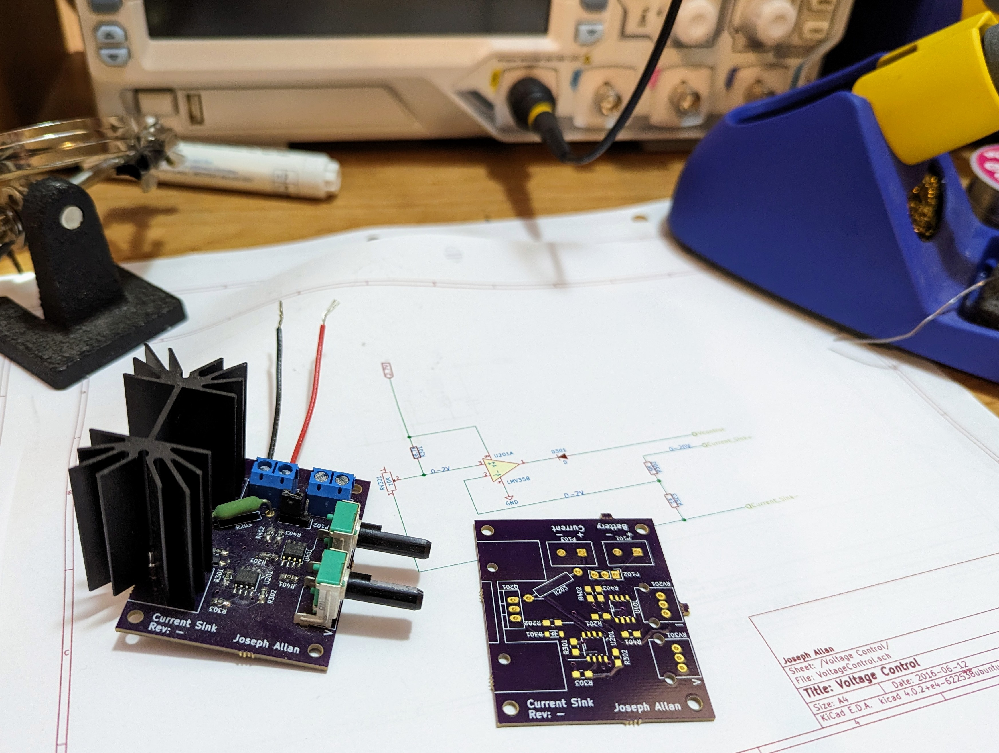

# csos

Current sink PCB for battery testing. Designed in KiCad. Includes circuit simulation (LTspice) and GERBER manufacturing files (configured for OSH Park fab). Studying Contextual Electronics courseware.

